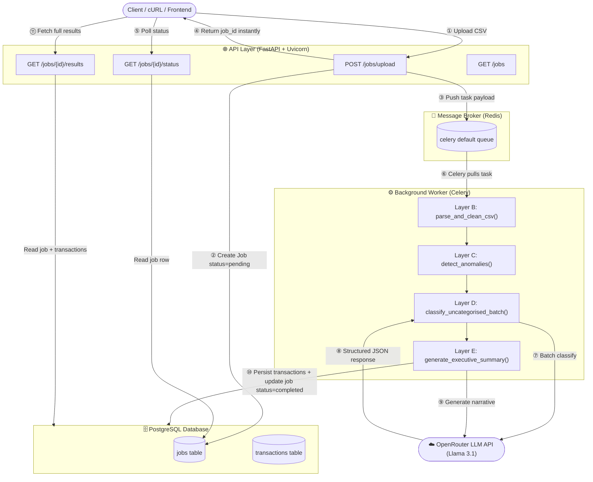
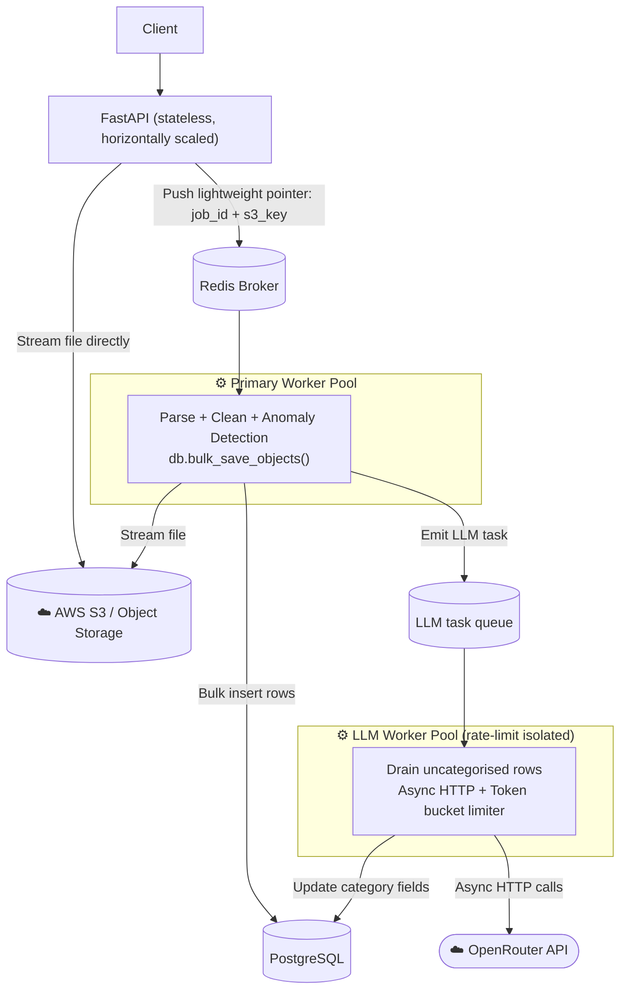

# Alemeno — AI-Powered Transaction Processing Pipeline

A high-throughput, containerized backend pipeline that ingests raw, "dirty" CSV exports, queues processing asynchronously, cleans and normalizes data, isolates statistical anomalies, and leverages a Large Language Model via OpenRouter to categorize transactions and generate a behavioral executive summary.

---

## Table of Contents

1. [Tech Stack](#tech-stack)
2. [System Architecture](#system-architecture)
3. [Component Deep-Dive](#component-deep-dive)
   - [Layer A — API Edge & Job Tracking](#layer-a--api-edge--job-tracking)
   - [Layer B — Data Ingestion & Cleaning](#layer-b--data-ingestion--cleaning)
   - [Layer C — Anomaly Detection](#layer-c--anomaly-detection)
   - [Layer D — LLM Batch Classification](#layer-d--llm-batch-classification)
   - [Layer E — Executive Summary Generation](#layer-e--executive-summary-generation)
4. [Data Flow: Request Lifecycle](#data-flow-request-lifecycle)
5. [Database Schema](#database-schema)
6. [Setup & Running](#setup--running)
7. [API Reference](#api-reference)
8. [Fault Tolerance & Error Handling](#fault-tolerance--error-handling)
9. [Scalability Analysis & Future Architecture](#scalability-analysis--future-architecture)

---

## Tech Stack

| Layer | Technology |
|---|---|
| **API Framework** | FastAPI + Uvicorn (ASGI) |
| **Database** | PostgreSQL via SQLAlchemy ORM |
| **Message Broker** | Redis |
| **Background Workers** | Celery |
| **LLM Gateway** | OpenRouter (OpenAI SDK) — `openrouter/free` (Llama 3.1) |
| **Data Validation** | Pydantic v2 |
| **Containerisation** | Docker & Docker Compose |

---

## System Architecture

The system is built around a **producer-consumer (asynchronous decoupled) pattern**. The FastAPI web server acts as the producer — it accepts requests, creates database records, and immediately delegates all heavy processing to a Celery consumer worker via a Redis message queue. This ensures the API layer remains non-blocking and can return responses to clients in milliseconds.



---

## Component Deep-Dive

### Layer A — API Edge & Job Tracking

**Files:** `src/api/routes.py`, `src/models/job.py`, `src/schemas/job.py`

The FastAPI router exposes 4 endpoints under the `/jobs` prefix. The upload endpoint is deliberately kept thin:

1. **Validates** that the file is a `.csv` extension and is UTF-8 decodable.
2. **Creates a `Job` database row** with `status = "pending"` and persists it immediately — this row acts as the single source of truth for the entire pipeline run.
3. **Pushes the task** to the Redis queue using `process_transaction_job.delay(job_id, csv_content)` — the raw CSV string and the job UUID are the entire task payload.
4. **Returns the `job_id`** to the client in ~5ms, long before processing starts.

The client then polls `GET /jobs/{id}/status` to track state transitions: `pending → processing → completed / failed`. The `GET /jobs/{id}/results` endpoint is **gated** — it returns an empty transaction list if the job is still in `pending` or `processing` state, preventing partial-data reads.

**Job Status State Machine:**
```
pending ──► processing ──► completed
                │
                └──────────► failed
```

---

### Layer B — Data Ingestion & Cleaning

**File:** `src/services/cleaning.py`

Designed for **defensive parsing** of real-world dirty CSV exports where column names differ between banks, amounts include currency symbols, and dates use multiple formats.

| Problem | Solution |
|---|---|
| Inconsistent column headers | Case-insensitive synonym mapping (e.g., `Transaction ID`, `tx_id`, `txnid` → `txn_id`) |
| Mixed date formats | Tries `DD-MM-YYYY`, `YYYY/MM/DD`, `YYYY-MM-DD` in order; normalizes to ISO 8601 |
| Currency symbols in amounts | Strips `$`, `₹`, and commas; casts to `float` |
| Missing status fields | Defaults to `"PENDING"` |
| Missing currency fields | Defaults to `"INR"` |
| Missing category fields | Defaults to `"Uncategorised"` (triggers LLM classification in Layer D) |
| Duplicate records | Generates a structural tuple signature `(txn_id, date, merchant, amount, currency, status, category, account_id)` and deduplicates using a `set` |

---

### Layer C — Anomaly Detection

**File:** `src/services/anomaly.py`

Two independent anomaly rules run over the cleaned records:

**Rule 1 — Statistical Outlier (Amount Threshold):**
Transactions are grouped by `account_id`. The median transaction amount is computed per account. Any transaction where `amount > 3 × account_median` is flagged.

> Using the **median** (not mean) makes this robust to outliers skewing the threshold itself — a standard statistical design choice.

**Rule 2 — Logical Currency Mismatch:**
If a transaction's `currency` is `USD` but the `merchant` is a known domestic Indian brand (`swiggy`, `ola`, `irctc`), it is flagged. This catches encoding errors or suspicious cross-border charges on domestic-only services.

Both rules are non-exclusive — a single transaction can trigger both. Reasons are concatenated with `"; "` into the `anomaly_reason` field.

---

### Layer D — LLM Batch Classification

**File:** `src/services/llm.py`

All transactions still marked as `"Uncategorised"` after cleaning are collected and sent to OpenRouter in a **single batched prompt**. Instead of making one API call per transaction (N × latency), the entire uncategorised set is packaged into one JSON payload.

**Valid output categories (type-enforced via Pydantic `Literal`):**
`Food`, `Shopping`, `Travel`, `Transport`, `Utilities`, `Cash Withdrawal`, `Entertainment`, `Other`

**Prompt Strategy:**
Each uncategorised transaction is assigned a `temp_id` (its list index as a string). The LLM returns a `BatchCategoryResponse` JSON object with an `assignments` list. The service maps `temp_id` back to the original list index to update the `category` field in-place.

**Retry Logic:**
An exponential backoff helper (`call_llm_with_retry`) wraps every LLM call with up to **3 attempts**, doubling the delay on each failure (2s → 4s → 8s). If all retries are exhausted, affected rows have `llm_failed = True` written to the database and processing **continues** rather than crashing the entire job.

---

### Layer E — Executive Summary Generation

**File:** `src/services/llm.py` (`generate_executive_summary`)

After classification, a second LLM call generates a structured executive report. The service first **calculates hard metrics locally** (total INR spend, total USD spend, anomaly count) and passes them as context alongside up to 50 transaction summaries. The LLM returns:

| Field | Description |
|---|---|
| `total_spend_inr` / `total_spend_usd` | Spend totals by currency |
| `top_merchants` | Top 3 merchants by spend/frequency |
| `anomaly_count` | Confirmed count of flagged transactions |
| `narrative` | 2–3 sentence behavioral summary of spending patterns |
| `risk_level` | One of `low`, `medium`, `high` |

If this LLM call fails after all retries, a **safe fallback** uses pre-computed local metrics with a default narrative string, ensuring the job still reaches `completed` status.

---

## Data Flow: Request Lifecycle

```
Client
  │
  ├─① POST /jobs/upload (CSV file)
  │
  │  [FastAPI — Layer A]
  │  ├─ Validate extension & decode UTF-8
  │  ├─ INSERT jobs row (status=pending)
  │  ├─ PUSH task → Redis queue (job_id + raw csv string)
  │  └─② Return { job_id } → Client  ← ~5ms

  │  [Celery Worker — runs out-of-band]
  │  ├─ UPDATE jobs SET status=processing
  │  │
  │  ├─ [Layer B] parse_and_clean_csv()
  │  │     normalize headers, clean dates/amounts/currencies,
  │  │     deduplicate rows via structural signature hashing
  │  │
  │  ├─ [Layer C] detect_anomalies()
  │  │     group by account_id → compute per-account medians
  │  │     flag amount > 3× median  |  flag USD on domestic brands
  │  │
  │  ├─ [Layer D] classify_uncategorised_batch()
  │  │     bundle all "Uncategorised" rows into one JSON prompt
  │  │     → POST OpenRouter (Llama 3.1) with exponential backoff
  │  │     ← parse BatchCategoryResponse → map categories back by temp_id
  │  │
  │  ├─ [Layer E] generate_executive_summary()
  │  │     compute spend totals, anomaly count locally
  │  │     → POST OpenRouter for narrative + risk_level
  │  │     ← parse ExecutiveSummaryResponse (fallback if failed)
  │  │
  │  ├─ db.add_all(transaction_objects)   ← bulk insert all child rows
  │  ├─ UPDATE jobs SET status=completed + all metrics
  │  └─ db.commit()

  ├─③ GET /jobs/{id}/status  (poll until status=completed)
  └─④ GET /jobs/{id}/results (fetch full structured data)
```

---

## Database Schema

```
┌──────────────────────────────────────────────────────┐
│                         jobs                         │
├──────────────────┬───────────────────────────────────┤
│ id               │ UUID (Primary Key)                 │
│ status           │ pending | processing | completed | failed │
│ filename         │ Original uploaded filename         │
│ row_count_raw    │ Total rows parsed from CSV         │
│ row_count_clean  │ Rows remaining after deduplication │
│ total_spend_inr  │ Float                              │
│ total_spend_usd  │ Float                              │
│ top_merchants    │ JSON array of strings              │
│ anomaly_count    │ Integer                            │
│ narrative        │ LLM-generated executive text       │
│ risk_level       │ low | medium | high                │
│ error_message    │ Error trace on failure             │
│ created_at       │ Timestamp                          │
│ updated_at       │ Timestamp (auto-updated on write)  │
└──────────────────┴───────────────────────────────────┘
          │ 1
          │ has many (cascade delete)
          ▼ N
┌──────────────────────────────────────────────────────┐
│                    transactions                      │
├──────────────────┬───────────────────────────────────┤
│ id               │ Integer (PK, auto-increment)       │
│ job_id           │ Foreign Key → jobs.id              │
│ txn_id           │ Original transaction ID from CSV   │
│ date             │ ISO 8601 date string (YYYY-MM-DD)  │
│ merchant         │ Merchant / vendor name             │
│ amount           │ Float (stripped of currency chars) │
│ currency         │ INR | USD (normalized uppercase)   │
│ status           │ COMPLETED | PENDING | FAILED...    │
│ category         │ Food | Shopping | Travel | ...     │
│ account_id       │ Source account identifier          │
│ notes            │ Free-text notes field              │
│ is_anomaly       │ Boolean                            │
│ anomaly_reason   │ Human-readable anomaly description │
│ llm_failed       │ Boolean — LLM classification failed│
└──────────────────┴───────────────────────────────────┘
```

---

## Setup & Running

### Prerequisites

| Method | Requirements |
|---|---|
| **Docker (Recommended)** | Docker Engine + Docker Compose |
| **Local Development** | Python 3.9+, running PostgreSQL instance, running Redis instance |

### Environment Configuration

Create a `.env` file in the project root:

> **Local development note:** Change `POSTGRES_HOST` from `db` to `localhost` and `REDIS_URL` host from `redis` to `localhost`.

```env
# ── Database ──────────────────────────────────────────
POSTGRES_USER=postgres
POSTGRES_PASSWORD=postgres
POSTGRES_DB=alemeno
POSTGRES_HOST=db          # Use 'localhost' for local dev (not Docker)
POSTGRES_PORT=5432

# ── Message Broker ────────────────────────────────────
REDIS_URL=redis://redis:6379/0   # Use redis://localhost:6379/0 for local dev

# ── LLM Gateway ───────────────────────────────────────
OPENROUTER_API_KEY=your_openrouter_api_key_here
```

---

### Option 1: Docker Compose (Recommended)

Spins up all four services (FastAPI, Celery worker, Redis, PostgreSQL) with a single command. Zero manual dependency management needed.

```bash
docker compose up --build
```

| Endpoint | URL |
|---|---|
| REST API | `http://localhost:8000` |
| Swagger UI (interactive) | `http://localhost:8000/docs` |
| ReDoc | `http://localhost:8000/redoc` |

---

### Option 2: Local Development (Non-Dockerized)

Ensure PostgreSQL and Redis are already running locally, then open two separate terminal windows.

**Step 1 — Install dependencies (once):**
```bash
pip install -r requirements.txt
```

**Step 2 — Start the FastAPI web server (Terminal 1):**
```bash
# Run from the project root: c:\...\alemeno
uvicorn src.main:app --reload
```

**Step 3 — Start the Celery background worker (Terminal 2):**
```bash
# Run from the project root: c:\...\alemeno

# On Linux / macOS / Docker:
celery -A src.workers.celery_app worker --loglevel=info

# On Windows — REQUIRED flag (see note below):
celery -A src.workers.celery_app worker --loglevel=info --pool=solo
```

> **Windows Note:** Celery's default `prefork` concurrency model uses POSIX shared memory primitives that are not supported on Windows, causing `PermissionError: [WinError 5] Access is denied`. The `--pool=solo` flag bypasses this by running tasks single-threaded in the main process. This is fine for local development. Use Docker for production-equivalent multi-threaded behaviour.

---

## API Reference

### `POST /jobs/upload` — Upload a CSV File

Validates the file, registers a job tracking record, and immediately starts asynchronous background processing.

```bash
curl -X POST "http://localhost:8000/jobs/upload" \
  -H "Content-Type: multipart/form-data" \
  -F "file=@transactions.csv"
```

**Response `201 Created`:**
```json
{
  "job_id": "8a345caa-616e-4b4d-b934-a38066053b1f",
  "message": "File uploaded successfully. Processing started."
}
```

---

### `GET /jobs/{job_id}/status` — Poll Job Status

Lightweight endpoint — safe to call frequently for polling. Returns current state and anomaly count.

```bash
curl "http://localhost:8000/jobs/8a345caa-616e-4b4d-b934-a38066053b1f/status"
```

**Response:**
```json
{
  "job_id": "8a345caa-616e-4b4d-b934-a38066053b1f",
  "status": "completed",
  "anomaly_count": 5,
  "created_at": "2026-06-23T23:57:37.712130"
}
```

Possible `status` values: `pending`, `processing`, `completed`, `failed`.

---

### `GET /jobs/{job_id}/results` — Retrieve Full Results

Returns all processed transactions and the full LLM-generated executive summary. Returns an empty `transactions` list if the job has not yet completed (no partial reads).

```bash
curl "http://localhost:8000/jobs/8a345caa-616e-4b4d-b934-a38066053b1f/results"
```

**Response (truncated):**
```json
{
  "id": "8a345caa-616e-4b4d-b934-a38066053b1f",
  "status": "completed",
  "total_spend_inr": 1339923.0,
  "total_spend_usd": 74185.14,
  "top_merchants": ["Flipkart", "Amazon", "Swiggy"],
  "anomaly_count": 5,
  "narrative": "Spending heavily skewed toward retail shopping...",
  "risk_level": "medium",
  "transactions": [
    {
      "txn_id": "TXN1065",
      "date": "2024-09-04",
      "merchant": "Flipkart",
      "amount": 10882.55,
      "currency": "INR",
      "category": "Shopping",
      "is_anomaly": false,
      "anomaly_reason": null,
      "llm_failed": false
    }
  ]
}
```

---

### `GET /jobs` — List All Jobs

Lists all historical pipeline runs ordered by newest first, with optional status filtering.

```bash
# All jobs
curl "http://localhost:8000/jobs"

# Filter by status
curl "http://localhost:8000/jobs?status=completed"
curl "http://localhost:8000/jobs?status=failed"
```

---

## Fault Tolerance & Error Handling

| Failure Scenario | Behaviour |
|---|---|
| Non-CSV file uploaded | `400 Bad Request` returned immediately |
| Malformed / non-UTF-8 file | `400 Bad Request` returned immediately |
| Redis broker unreachable at upload time | Job marked `failed` in DB; `500` returned to client |
| Celery worker task crashes unexpectedly | `db.rollback()` called; job marked `failed` with `error_message` |
| OpenRouter API rate-limited or down | Exponential backoff: 2s → 4s → 8s, max 3 retries per call |
| LLM classification fails after all retries | Affected rows get `llm_failed=True`; job **continues** gracefully |
| Executive summary LLM call fails | Pre-computed local metrics used as fallback; job still completes |
| Results fetched before job finishes | Empty `transactions` list returned safely; no crash or partial data |

---

## Scalability Analysis & Future Architecture

This architecture is optimised for development and evaluation workloads. Below is an analysis of where it breaks at 100× production traffic and the engineering path forward.

### Current Bottlenecks

**1. Memory Bottleneck — The Broker Trap**

The raw CSV string is passed directly as the Celery task payload through Redis. At evaluation scale (hundreds of KB), this is fine. At 50MB+ enterprise exports with high concurrency:
- Redis memory spikes dramatically (Redis is in-memory by design)
- Risk of Redis OOM (Out-Of-Memory) container crash
- Task serialization overhead grows linearly with file size

**2. Compute Bottleneck — The API Rate-Limit Wall**

LLM calls run synchronously inside Celery worker threads. At scale:
- Workers block on HTTP handshakes to OpenRouter, wasting CPU slots on I/O wait
- High worker concurrency exhausts the PostgreSQL connection pool as workers hold connections while blocked
- A single upstream API throttle event stalls the entire processing queue

---

### Proposed Next-Iteration Architecture



**Fix 1 — Object Storage Pointer Pattern:**
FastAPI streams raw uploads directly to S3. The Redis task payload becomes a tiny JSON pointer `{ "job_id": "...", "s3_key": "..." }`, keeping broker memory usage near-zero regardless of file size. Trade-off: slight network I/O latency when the worker fetches the file from S3.

**Fix 2 — Decoupled LLM Worker Pool:**
The primary worker handles only parsing, anomaly detection, and `db.bulk_save_objects()` (fast bulk insert), then emits a second event to a dedicated LLM task queue. A separate, smaller async worker pool drains that queue with token-bucket rate limiters. This fully isolates upstream API throttling from the data pipeline and eliminates PostgreSQL connection pool starvation.
