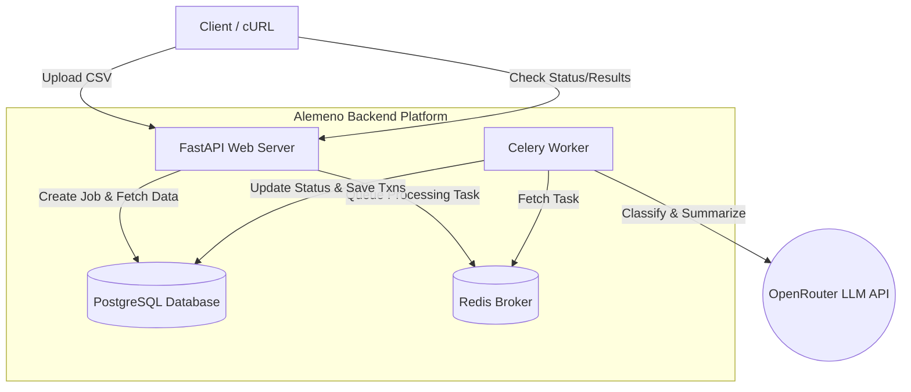

# Alemeno AI-Powered Transaction Processing Pipeline

This repository contains the backend implementation for an AI-powered financial transaction processing pipeline. The system accepts dirty CSV data, queues it for asynchronous processing, cleans the data, identifies anomalies, and leverages an LLM (via OpenRouter) to categorize transactions and generate an executive summary report.

## Tech Stack
* **API Framework:** FastAPI
* **Database:** PostgreSQL (with SQLAlchemy)
* **Job Queue:** Celery + Redis
* **LLM:** OpenRouter (OpenAI SDK) using `openrouter/free`
* **Containerisation:** Docker & Docker Compose

## Features
1. **Asynchronous Processing:** File uploads immediately return a Job ID while processing happens in the background via Celery.
2. **Data Cleaning:** Normalizes dates to ISO 8601, strips currency symbols, normalizes statuses, and drops exact duplicates.
3. **Anomaly Detection:** Flags statistical outliers (amounts > 3x the account median) and suspicious currency combinations (e.g., USD for domestic merchants like Swiggy/Ola).
4. **LLM Integration:** 
   * Batched classification for uncategorized transactions into predefined enum categories.
   * Executive summary generation with calculated metrics and an AI-driven behavioral narrative.
5. **Fault Tolerance:** Includes exponential backoff retries for LLM API limits/failures.

## Architecture



## Setup Instructions

### Prerequisites
* **Option 1 (Recommended):** Docker and Docker Compose installed on your machine.
* **Option 2 (Local):** Python 3.9+, PostgreSQL, and Redis running locally.

### Environment Setup
Create a `.env` file in the root directory with the following structure. *(Note: If running locally without Docker, change `POSTGRES_HOST` to `localhost` and `REDIS_URL` to `redis://localhost:6379/0`)*.

```env
# Database Settings
POSTGRES_USER=postgres
POSTGRES_PASSWORD=postgres
POSTGRES_DB=alemeno
POSTGRES_HOST=db
POSTGRES_PORT=5432

# Redis
REDIS_URL=redis://redis:6379/0

# OpenRouter LLM Configuration
OPENROUTER_API_KEY=your_openrouter_api_key_here
```

### Running the Application

#### Option 1: Using Docker Compose (Recommended)
The entire system (API, Celery worker, Redis, and PostgreSQL) is containerized and starts with a single command.

```bash
docker compose up --build
```
*The API will be available at `http://localhost:8000`*
*(Swagger UI is available at `http://localhost:8000/docs`)*

#### Option 2: Running Locally (Non-Dockerized)
Ensure you have activated your virtual environment and that your local PostgreSQL and Redis instances are running.

1. **Install dependencies:**
   ```bash
   pip install -r requirements.txt
   ```
2. **Start the FastAPI Web Server:**
   ```bash
   uvicorn src.main:app --reload
   ```
3. **Start the Celery Worker (in a separate terminal):**
   ```bash
   celery -A src.workers.celery_app worker --loglevel=info
   ```

---

## Example API cURL Requests

### 1. Upload a CSV
Upload your raw financial transactions CSV to begin processing.
```bash
curl -X POST "http://localhost:8000/jobs/upload" \
  -H "accept: application/json" \
  -H "Content-Type: multipart/form-data" \
  -F "file=@transactions.csv"
```
**Response:**
```json
{
  "job_id": "8a345caa-616e-4b4d-b934-a38066053b1f",
  "message": "File uploaded successfully. Processing started."
}
```

### 2. Check Job Status
Check if your job is pending, processing, completed, or failed.
```bash
curl -X GET "http://localhost:8000/jobs/8a345caa-616e-4b4d-b934-a38066053b1f/status" \
  -H "accept: application/json"
```
**Response:**
```json
{
  "job_id": "8a345caa-616e-4b4d-b934-a38066053b1f",
  "status": "completed",
  "summary": {
    "total_transactions": 95,
    "clean_transactions": 85,
    "created_at": "2026-06-23T23:57:37.712130"
  }
}
```

### 3. Retrieve Full Job Results
Once completed, retrieve the structured summary and all processed transactions.
```bash
curl -X GET "http://localhost:8000/jobs/8a345caa-616e-4b4d-b934-a38066053b1f/results" \
  -H "accept: application/json"
```
**Response (Truncated):**
```json
{
  "id": "8a345caa-616e-4b4d-b934-a38066053b1f",
  "status": "completed",
  "total_spend_inr": 1339923.0,
  "total_spend_usd": 74185.14,
  "top_merchants": ["Flipkart", "Amazon", "Swiggy"],
  "anomaly_count": 5,
  "narrative": "Spending heavily skewed toward retail shopping...",
  "risk_level": "medium",
  "transactions": [
    {
      "txn_id": "TXN1065",
      "date": "2024-09-04",
      "merchant": "Flipkart",
      "amount": 10882.55,
      "currency": "INR",
      "category": "Shopping",
      "is_anomaly": false
    }
  ]
}
```

### 4. List All Jobs
List historical jobs, optionally filtering by status.
```bash
curl -X GET "http://localhost:8000/jobs?status=completed" \
  -H "accept: application/json"
```
